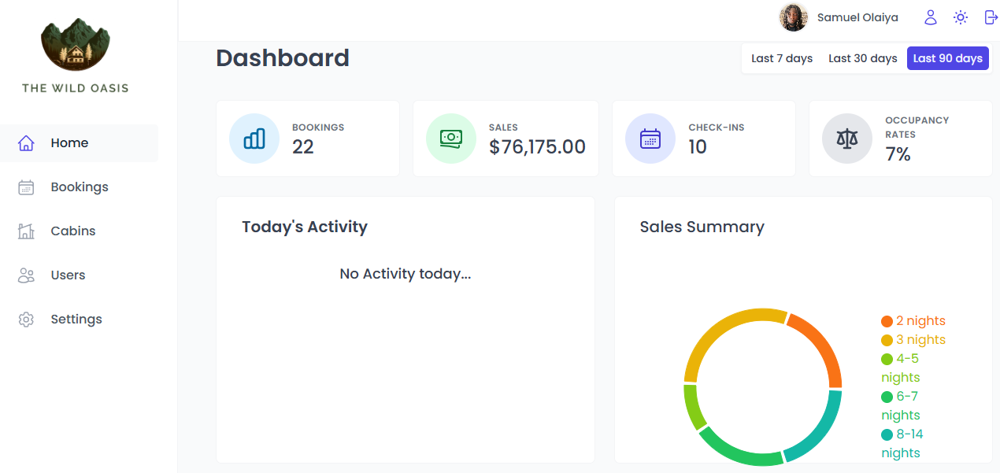

# 🌴 The Wild Oasis

The Wild Oasis is a modern hotel management dashboard built to help hotel staff manage cabins, bookings, guests, and payments efficiently.

## 🚀 Features

- User authentication with protected routes
- Cabin management (create, update, delete)
- Booking and guest management
- Dashboard with statistics and charts
- Responsive and clean UI

## 🛠️ Tech Stack

- React
- React Router
- React Query
- Supabase (Authentication & Database)
- Tailwind CSS
- Recharts

## 📸 Screenshots



## ⚙️ Installation

```bash
git clone https://github.com/your-username/the-wild-oasis.git
cd wild-oasis
npm install
npm run dev
```

## 📌What I Learned

- Managing server state using React Query
- Implementing authentication and Row Level Security with Supabase
- Building scalable dashboard layouts
- Structuring a real-world React application

## 🌎 Live Demo

[Live Site](wildoasismanagement.netlify.app)

## 📁 Repository

This repository contains the full source code, configuration, and assets for The Wild Oasis dashborad.
[Github Repo](https://github.com/samz845/wild-oasis)
